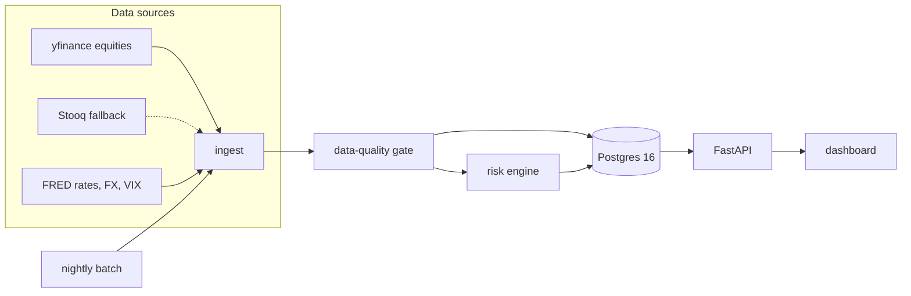
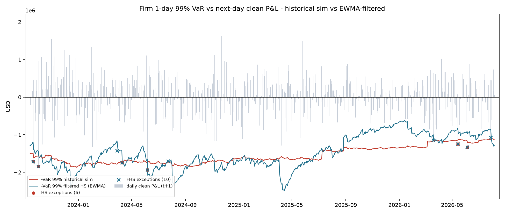
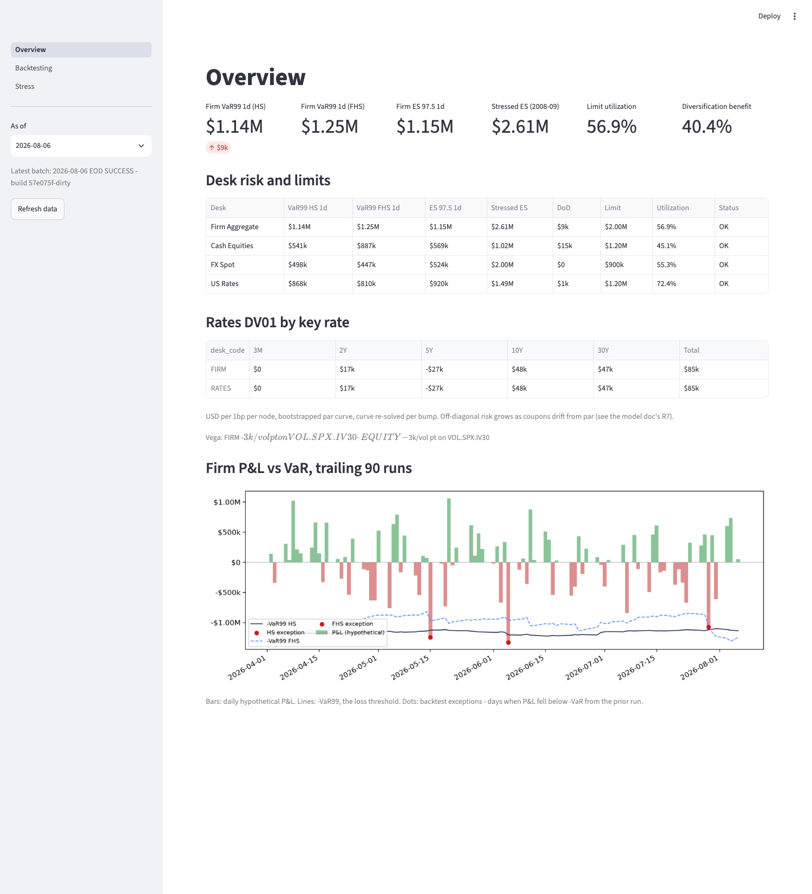
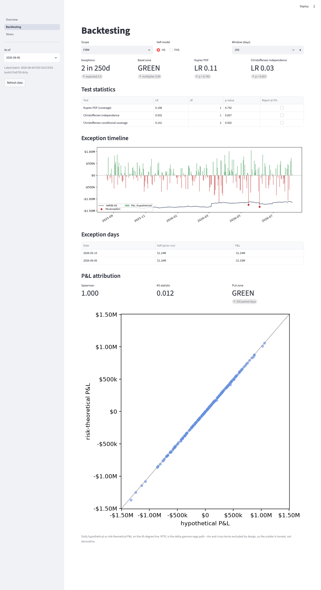
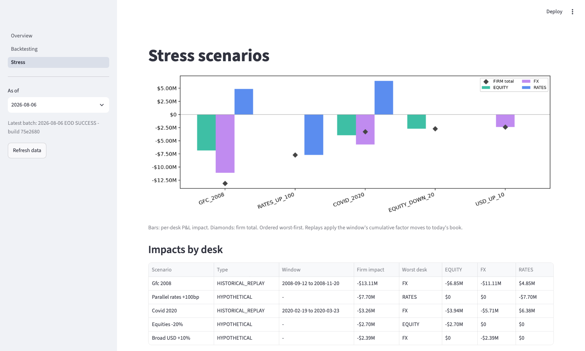

# RiskDesk

[](https://github.com/rohankannan/market-risk-platform/actions/workflows/ci.yml)

**Live:** [dashboard](https://riskdeskdash.onrender.com) · [API docs](https://riskdesk.onrender.com/docs) — refreshed nightly by a scheduled batch; free-tier hosting, so the first load after idle takes ~30–60 s.

An end-of-day **market-risk platform** for a mock three-desk trading book (cash equities, FX spot, US rates), built the way a bank's risk desk runs its nightly cycle: ingest market data → data-quality gate → revalue the book → VaR / Expected Shortfall → limit checks → stress replay → regulatory backtesting → dashboard.

> Every night, a bank's market-risk function runs exactly this loop. This is a small but complete version of it — real market data, a real database, tested math, and the validation statistics regulators actually use.

## Architecture



## The backtest

750 trading days of out-of-sample 1-day 99% VaR on the firm book, against next-day clean P&L:



| method | days | exceptions | expected | Kupiec p | Christoffersen CC p | Basel zone (250d) |
|---|---|---|---|---|---|---|
| Historical sim | 750 | 5 | 7.5 | 0.33 | 0.60 | GREEN |
| Filtered HS (EWMA) | 750 | 10 | 7.5 | 0.38 | 0.60 | GREEN |

The equal-weight 500-day window makes plain historical sim slow in both directions: it stays wide through the calm late-2025 regime (capital inefficiency) and only steps up months after the April 2025 vol spike, once those scenarios finally enter the window. The EWMA-filtered VaR tracks the regime — wider into stress, tighter in calm — with coverage near the nominal 1%. Regenerate with `python -m risk.jobs.backfill`.

## The dashboard

Three Streamlit pages over the API — tiles, limits, and the P&L-vs-VaR timeline on Overview; Kupiec/Christoffersen/traffic-light statistics on Backtesting; per-desk scenario P&L on Stress. (The richer React dashboard is the winter roadmap.)







## What's implemented (honest status)

| Component | Status |
|---|---|
| Risk engine core: HS VaR, EWMA filtering + FHS scenarios, ES 97.5, bond pricer (DV01/convexity by bump-and-reprice) | ✅ implemented, known-answer tested |
| Backtesting stats: Kupiec POF, Christoffersen (independence + conditional coverage), Basel traffic light with multiplier add-ons | ✅ implemented, known-answer tested |
| Postgres schema (13 tables) + Alembic migration + showcase analytics SQL | ✅ |
| Portfolio / factor definitions (desk mix calibrated to disclosed bank VaR risk-class shares), hypothetical shock catalog | ✅ (`data/seed/`, `scenarios/`) |
| Committed 2007+ market snapshot (17 factors), snapshot pipeline w/ source fallbacks | ✅ (`risk/jobs/snapshot.py`) |
| Seed loader (COPY-based, idempotent), portfolio revaluation engine (full reval + delta-gamma) | ✅ |
| 750-day out-of-sample backfill + backtest chart and stats | ✅ (`risk/jobs/backfill.py`) |
| EOD batch: ingestion w/ fallbacks, DQ gate (`dq_issues`, PARTIAL on blocks), risk + exception writes, scenario runs, idempotent run claims, DB backfill mode | ✅ (`risk/jobs/eod.py`) |
| Stress replays (GFC 2008, COVID 2020) + hypothetical shocks, written per run | ✅ |
| FastAPI read layer over the results tables: meta, risk summary w/ limit utilization + diversification, history, backtest stats, scenario results; typed response models, immutable caching on pinned `as_of` | ✅ (`api/`) |
| Streamlit dashboard, 3 pages reading the API (Overview w/ tiles + limit table + P&L-vs-VaR chart, Backtesting w/ Kupiec/Christoffersen/zone, Stress w/ per-desk scenario P&L) | ✅ (`dashboard/`) |
| One-command Docker Compose stack (bootstrap + API + dashboard + opt-in APScheduler night cycle); CI runs tests, the full pipeline against Postgres, and the compose acceptance path | ✅ (`Dockerfile`, `docker-compose.yml`, `.github/workflows/`) |
| SR 11-7-structured model documentation with a full assumptions-and-limitations inventory | ✅ (`docs/model_doc.md`) |
| Quantified risks-not-in-VaR inventory: horizon-scaling error, async-close correlation bias, forward-fill vol damping, stressed-window sensitivity, ES concentration — measured from the snapshot, regenerable | ✅ (`docs/rniv.md`, `risk/jobs/rniv.py`) |
| Champion/challenger harness: hand-rolled GARCH(1,1) QMLE vs the EWMA champion, parallel-run over 250 days under pre-registered promotion criteria with a fit-health gate — current verdict HOLD, boundary fits named | ✅ (`docs/challenger_garch.md`, `risk/jobs/challenger.py`) |
| Ops controls: day-over-day flash check (firm VaR moves arrive pre-explained with desk and vol attribution) and a vendor-revision log with classified before-images and a `--force` restatement path | ✅ (`risk_engine/dq.py`, `data_revisions`) |
| Hosted deploy: Neon Postgres, API + dashboard on Render, nightly EOD batch via GitHub Actions cron | ✅ (links above) |
| ≤90s demo video | 🔜 milestone 3 (by Oct 15) |
| Parametric VaR w/ implied vol, options sleeve → PLA test, CCAR-style scenarios, React dashboard | 🔜 winter |

## Quickstart

One command, no local Python needed — Docker builds one image, bootstraps the database from the committed snapshot (schema → book → 300-day backfill → one full EOD run, all offline), then serves both surfaces:

```bash
docker compose up
```

API on <http://localhost:8000/docs>, dashboard on <http://localhost:8501>. CI runs this exact path on every push. For development:

```bash
make venv        # python3.11+ virtualenv, editable install
make test        # known-answer test suite (no network, no DB needed)
make demo        # db-up + migrate + seed + 300-day backfill + EOD run, all offline
make api         # serve the API; interactive docs at http://localhost:8000/docs
make dashboard   # Streamlit UI on http://localhost:8501 (needs the API running)
```

## The nightly cycle in operation

- **Locally:** `docker compose --profile nightly up` adds the APScheduler service, which runs the EOD batch (with live market-data fetch) at 18:30 America/New_York on weekdays — after the NYSE close and the Fed's ~16:15 ET H.15 yield publication.
- **Deployed:** [`.github/workflows/eod.yml`](.github/workflows/eod.yml) runs the same entrypoint at 23:30 UTC weekdays against the hosted Postgres (repo secrets `DATABASE_URL`, `FRED_API_KEY`). Re-runs are safe: the batch claims `(run_date, run_type)` under an advisory lock and is idempotent.

## Design rules

- **Hand-roll anything an interviewer could ask you to derive** (EWMA recursion, VaR/ES estimators, Kupiec/Christoffersen likelihood ratios, bond pricing, traffic-light zones); import only optimizers and distribution functions (scipy `chi2`, `spearmanr`).
- **Return conventions are data, not code**: log returns for prices/FX, absolute bp for yields (log yield shocks explode when rates sit near zero, as in 2020) — carried on the `risk_factors` table.
- **P&L is exact, never linearized** in scenarios (`qty·S0·(exp(r)−1)`; bonds full-reval via closed-form). The linear approximation exists only in risk-theoretical P&L, so the future PLA test's HPL−RTPL gap is real and internally generated.
- **No demo, test, or CI run ever depends on a live third-party API** — the market-data snapshot is committed; live fetch is a top-up.
- **Loud failures**: data-quality breaches write `dq_issues` and mark the run `PARTIAL`; unimplemented steps exit non-zero with their scheduled milestone.

## Scope honesty

This implements the **ES piece of FRTB's internal-models approach** — 97.5% ES with stressed-period calibration — not liquidity horizons, NMRF, or (yet) the P&L-attribution test. PLA is deliberately deferred until the book has options: on a purely linear book, risk-theoretical and hypothetical P&L coincide and the test is vacuous. Full limitations: [docs/model_doc.md](docs/model_doc.md).

*Educational demonstration on public data; not investment advice.*
