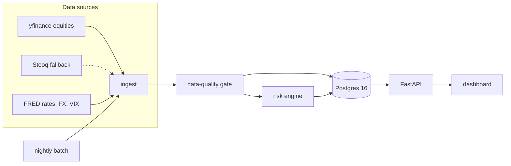

# RiskDesk

An end-of-day **market-risk platform** for a mock three-desk trading book (cash equities, FX spot, US rates), built the way a bank's risk desk runs its nightly cycle: ingest market data → data-quality gate → revalue the book → VaR / Expected Shortfall → limit checks → stress replay → regulatory backtesting → dashboard.

> Every night, a bank's market-risk function runs exactly this loop. This is a small but complete version of it — real market data, a real database, tested math, and the validation statistics regulators actually use.

## Architecture



## What's implemented (honest status)

| Component | Status |
|---|---|
| Risk engine core: HS VaR, EWMA filtering + FHS scenarios, ES 97.5, bond pricer (DV01/convexity by bump-and-reprice) | ✅ implemented, known-answer tested |
| Backtesting stats: Kupiec POF, Christoffersen (independence + conditional coverage), Basel traffic light with multiplier add-ons | ✅ implemented, known-answer tested |
| Postgres schema (13 tables) + Alembic migration + showcase analytics SQL | ✅ |
| Portfolio / factor definitions, hypothetical shock catalog | ✅ (`data/seed/`, `scenarios/`) |
| Ingestion, DQ gate, batch orchestration, `backfill_var` | 🔜 milestone 2 (by Sep 14) |
| Stress replays (GFC 2008, COVID 2020), FastAPI result endpoints, dashboard | 🔜 milestone 3 (by Oct 15) |
| Parametric VaR w/ implied vol, options sleeve → PLA test, CCAR-style scenarios, React dashboard | 🔜 winter |

## Quickstart

```bash
make venv        # python3.11+ virtualenv, editable install
make test        # known-answer test suite (no network, no DB needed)
make db-up       # local Postgres 16 via docker compose
make migrate     # apply the schema
```

## Design rules

- **Hand-roll anything an interviewer could ask you to derive** (EWMA recursion, VaR/ES estimators, Kupiec/Christoffersen likelihood ratios, bond pricing, traffic-light zones); import only optimizers and distribution functions (scipy `chi2`, `spearmanr`).
- **Return conventions are data, not code**: log returns for prices/FX, absolute bp for yields (log yield shocks explode when rates sit near zero, as in 2020) — carried on the `risk_factors` table.
- **P&L is exact, never linearized** in scenarios (`qty·S0·(exp(r)−1)`; bonds full-reval via closed-form). The linear approximation exists only in risk-theoretical P&L, so the future PLA test's HPL−RTPL gap is real and internally generated.
- **No demo, test, or CI run ever depends on a live third-party API** — the market-data snapshot is committed; live fetch is a top-up.
- **Loud failures**: data-quality breaches write `dq_issues` and mark the run `PARTIAL`; unimplemented steps exit non-zero with their scheduled milestone.

## Scope honesty

This implements the **ES piece of FRTB's internal-models approach** — 97.5% ES with stressed-period calibration — not liquidity horizons, NMRF, or (yet) the P&L-attribution test. PLA is deliberately deferred until the book has options: on a purely linear book, risk-theoretical and hypothetical P&L coincide and the test is vacuous. Full limitations: [docs/model_doc.md](docs/model_doc.md).

*Educational demonstration on public data; not investment advice.*
